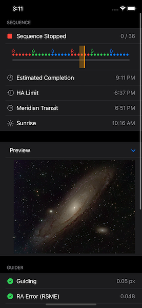
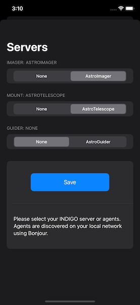

# INDIGO to GO
Monitor services using the INDIGO astronomy protocol from iOS &amp; Mac Catalyst 

* Uses Bonjour to discover agents on the network
* Reports sequence in progress
* progress bar images are colored according to my guess of your filter names
* Respects when sequence repeats
* Estimates completion time
* Calculates meridian and HA limits
* Calculates sunrise and displays a gradient from astronomical to true sunrise
* Displays the last image as a JPEG preview
* Displays cooler status
* Displays guiding status & RMSE
* Allows you to park the mount and/or disable the cooler at any time 

 

INDIGO to GO runs on any iPhone or iPad running iOS 14, and also any Mac running macOS 11 "Big Sur".

For more information, see https://github.com/indigo-astronomy/indigo and http://indigo-astronomy.org. For unrelated but fansastic commercial clients for macOS, see http://www.cloudmakers.eu.
